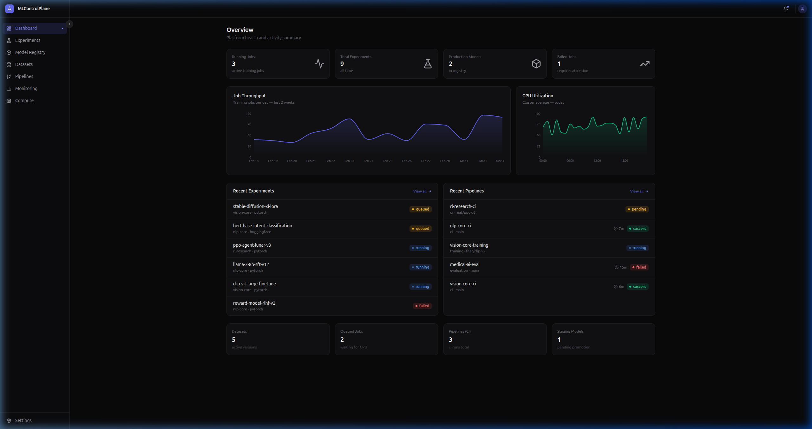
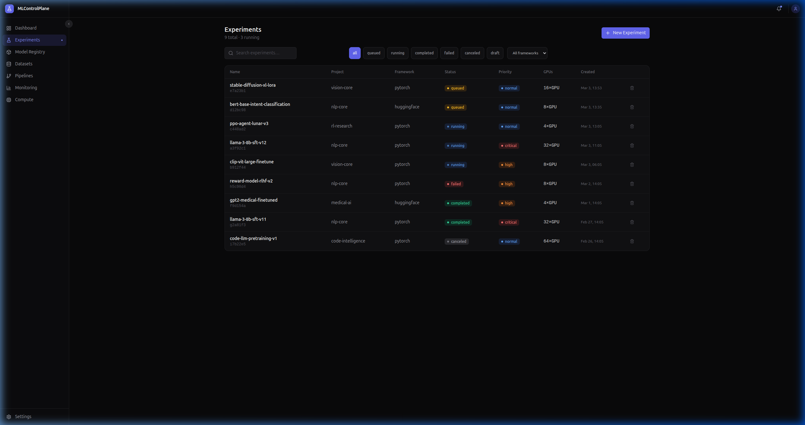
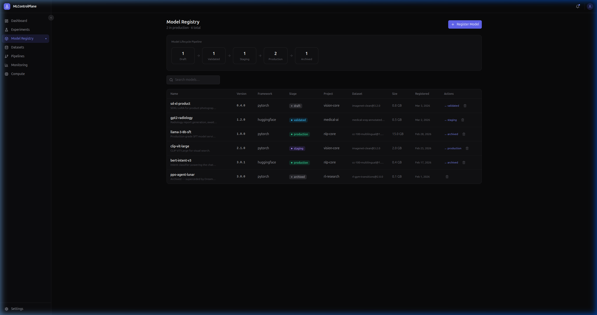
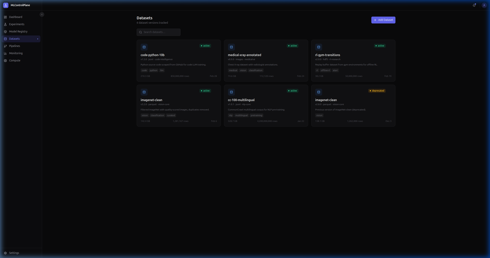
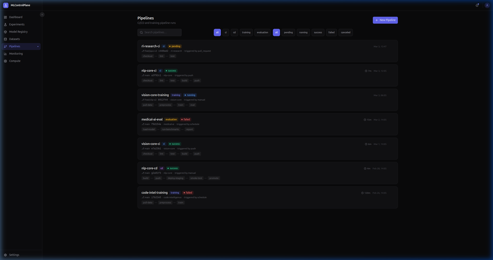
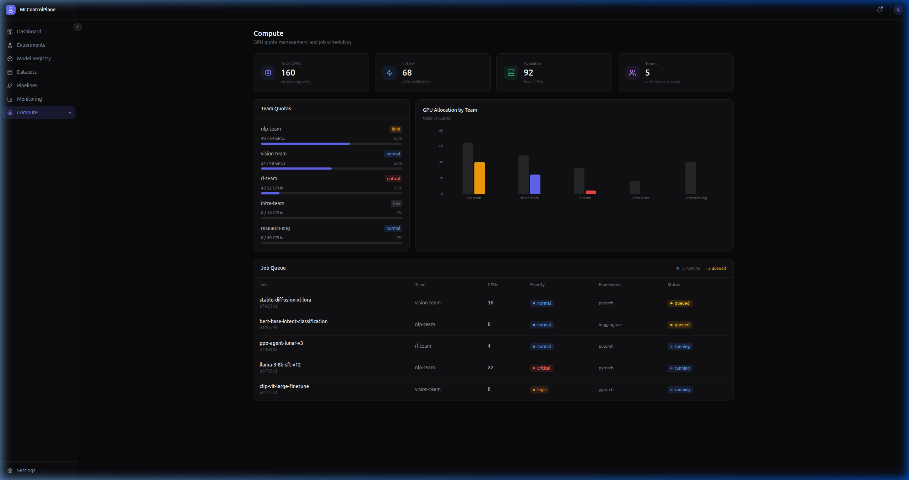
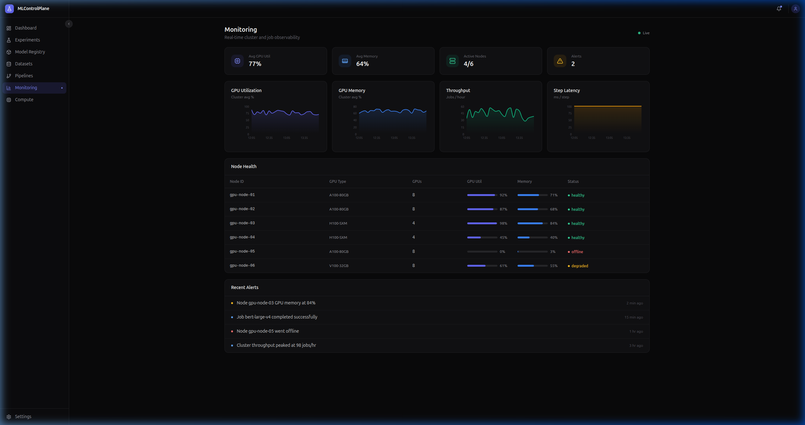

# MLControlPlane — AI Model Training & Experiment Orchestration Platform

> **Independent ML Platform Engineer — ResearchOps** · *Jan 2026 – Present*  
> Open-source portfolio project · [github.com/shaqiiee1984/MLControlPlane](https://github.com/shaqiiee1984/MLControlPlane)

---

## Overview

**MLControlPlane** is a full-stack MLOps platform designed to give AI research teams end-to-end control over the machine learning development lifecycle — from distributed GPU experiment scheduling through to production model deployment.

The project was designed and delivered as an independent engineering initiative targeting research teams running large-scale distributed training workloads. It integrates experiment orchestration, compute quota governance, CI/CD pipeline management, model registry lifecycle, dataset versioning, and real-time cluster observability into a single unified control plane.

The platform is architected to scale to **thousands of training jobs per day** across Kubernetes-managed GPU clusters, supporting multi-team collaboration with full traceability, reproducibility, and governance built in.

---

## 🖼️ Product Gallery

### **Main Dashboard**
Centralized overview of cluster health, active training jobs, and aggregate experiment metrics.


### **Experiment Management**
Deep-dive into training runs with hyperparameter tracking and priority-aware job queuing.


### **Model Registry**
Controlled lifecycle management from draft to production with automated promotion gates.


### **Dataset Catalog**
Versioned data artifacts with lineage tracking and format-specific metadata.


### **Pipeline Execution**
Real-time visualization of CI/CD, training, and evaluation workflows.


### **GPU Compute Governance**
Team-level quota management and fair-share resource allocation.


### **Cluster Observability**
High-fidelity monitoring of node health and GPU utilization.


---

## Key Engineering Contributions

### 🧪 Experiment Orchestration Engine
Architected a distributed training job scheduler supporting multi-node GPU cluster allocation (up to **64× H100-SXM** per job) with:
- Real-time status tracking across the full experiment lifecycle (`queued → running → completed / failed / canceled`)
- Priority queuing system (`low / normal / high / critical`) for fair, preemptive scheduling across research teams
- Hyperparameter versioning with immutable configuration snapshots, ensuring full experiment reproducibility
- Git commit tracking and container image pinning per run — eliminating manual job handoff and environment drift

### 📦 Model Registry & Lifecycle Management
Built a multi-stage model promotion pipeline with formal approval gates:

```
Draft → Validated → Staging → Production → Archived
```

- Artifact URL tracking linked to object storage (S3-compatible buckets)
- Dataset version lineage from training dataset through to deployed model
- Approved-by attribution and timestamp audit trail on every stage transition
- Framework metadata (PyTorch, TensorFlow, JAX, HuggingFace) stored per model version

### 🗃️ Dataset Versioning & Governance
Implemented a dataset catalog with:
- Multi-format ingestion support: `Parquet`, `JSONL`, `TFRecord`, `HDF5`, `Images`, `CSV`
- Schema validation, row-count tracking, and size metadata per dataset version
- Source URL lineage and deprecation workflows addressing **GDPR/PII data governance** requirements
- Tag-based discovery and project scoping for multi-team dataset sharing

### 📊 Observability & Cluster Monitoring
Delivered a real-time monitoring dashboard applying the **"Three Pillars" observability model** (metrics, logs, tracing):
- Per-node GPU/CPU utilization time-series charts with configurable refresh
- Cluster-wide memory pressure, throughput (jobs/hr), and step latency surfaced via `recharts`
- Node health table with status indicators (`healthy / degraded / offline`)
- Alert feed aggregating infrastructure events and anomalous metric behavior

### 🔁 CI/CD Pipeline Visualization
Engineered a pipeline management UI for `ci`, `cd`, `training`, and `evaluation` run types:
- Git branch and commit traceability on every pipeline run
- Trigger type tracking (`manual / push / pull_request / schedule`)
- Stage-by-stage execution visualization
- Duration tracking and per-run log URL linkage

### 💻 GPU Quota & Cost Management
Built a team-level GPU quota management system for FinOps-level resource governance:
- Per-team quota limits with real-time utilization bars and threshold-based color alerting (green / amber / red)
- Priority-aware scheduling visualization showing GPU allocation across teams
- Bar chart allocation views (Used vs. Quota) per team
- Job queue derived from live experiment entity state — no static mocks

### 🔒 Secure, Cloud-Native Architecture
Applied hardened engineering practices throughout the full stack:
- JWT-based API security with role-based access control (RBAC) — roles: Researcher, ML Engineer, Platform Engineer, Administrator
- OAuth2/OpenID Connect integration for enterprise SSO (configurable OIDC issuer)
- DevSecOps standards: SAST/OWASP-aligned security posture
- Containerized microservices deployment via Docker multi-stage builds with non-root user enforcement

---

## Architecture

```
┌─────────────────────────────────────────────────────────────────┐
│                         React SPA (Frontend)                    │
│  Dashboard · Experiments · Model Registry · Datasets            │
│  Pipelines · Monitoring · Compute · Settings                    │
└───────────────┬─────────────────────────────────────────────────┘
                │ REST / WebSocket
┌───────────────▼─────────────────────────────────────────────────┐
│              Spring Boot API Layer (Java 17)                    │
│  Idempotency keys · Resilience4j circuit breakers               │
│  Distributed tracing (correlation IDs) · OpenAPI docs           │
└──────┬────────────────┬────────────────────────┬────────────────┘
       │                │                        │
┌──────▼──────┐  ┌──────▼──────┐       ┌────────▼───────┐
│ PostgreSQL  │  │    Redis    │       │ Object Storage │
│ Experiment  │  │  Task queue │       │  Model weights │
│ metadata &  │  │  Caching    │       │  Dataset files │
│ lineage DAGs│  └─────────────┘       │  Eval reports  │
└─────────────┘                        └────────────────┘
       │
┌──────▼──────────────────────────────────────────────────────────┐
│              Kubernetes Cluster (GPU Infrastructure)            │
│  Training workers · HPA · Node affinity · Quota enforcement     │
└───────────────┬─────────────────────────────────────────────────┘
                │
┌───────────────▼─────────────────────────────────────────────────┐
│         Prometheus + Grafana (Observability Stack)              │
│  Custom alerting rules · SLO dashboards · Metric pipelines      │
└─────────────────────────────────────────────────────────────────┘
```

---

## Tech Stack

| Layer | Technology |
|---|---|
| **Frontend** | React 18, TypeScript, Vite, TailwindCSS, Recharts |
| **API Layer** | Spring Boot (Java 17), REST, WebSocket |
| **Database** | PostgreSQL — time-series experiment metrics, lineage DAGs |
| **Cache / Queue** | Redis |
| **Infrastructure** | Kubernetes + Helm, Docker (multi-stage builds) |
| **Observability** | Prometheus, Grafana, custom SLO dashboards |
| **CI/CD** | GitLab CI/CD — SAST, DAST, SCA, secret detection on every push |
| **Security** | JWT, OAuth2/OIDC, RBAC, OWASP-aligned posture |
| **IaC** | Terraform |

---

## Feature Matrix

| Feature | Entity | Status |
|---|---|---|
| Experiment creation, filtering, and detail view | `Experiment` | ✅ Complete |
| Model registry with promotion pipeline | `Model` | ✅ Complete |
| Dataset catalog with versioning & tags | `Dataset` | ✅ Complete |
| CI/CD & training pipeline management | `Pipeline` | ✅ Complete |
| GPU quota management & job queue | Compute | ✅ Complete |
| Real-time cluster monitoring & alerts | Monitoring | ✅ Complete |
| Platform settings, RBAC, SSO config | Settings | ✅ Complete |
| Responsive sidebar layout with collapse | Layout | ✅ Complete |
| CRUD with localStorage mock store (no backend required) | SDK | ✅ Complete |

---

## Local Development

### Prerequisites
- Node.js 18+
- npm 9+

### Setup

```bash
# 1. Clone the repository
git clone https://github.com/shaqiiee1984/MLControlPlane.git
cd MLControlPlane

# 2. Install dependencies
npm install

# 3. (Optional) Configure backend connection
#    Copy the example env file and set your values
cp .env.example .env.local
```

```env
# .env.local — only required when connecting to a live backend
VITE_MLCP_APP_ID=your_app_id
VITE_MLCP_APP_BASE_URL=https://your-backend.example.com

# optional
VITE_MLCP_FUNCTIONS_VERSION=stable
```

```bash
# 4. Start the dev server
npm run dev
```

> **No backend? No problem.** The application includes a fully-featured localStorage-backed mock store that seeds realistic experiment, model, dataset, and pipeline data on first load. Every CRUD operation (create, update, delete, list) works offline — ideal for local development and UI review.

---

## Entity Schemas

Defined under [`/entities`](./entities/):

| Schema | Required Fields | Key Enums |
|---|---|---|
| `Experiment` | `name`, `project` | status: `draft/queued/running/completed/failed/canceled` |
| `Model` | `name`, `version` | stage: `draft/validated/staging/production/archived` |
| `Dataset` | `name`, `version` | status: `active/deprecated/archived`, format: `parquet/csv/jsonl/tfrecord/hdf5/images` |
| `Pipeline` | `name`, `type` | type: `ci/cd/training/evaluation`, status: `pending/running/success/failed/canceled` |

---

## Project Structure

```
src/
├── api/            # API client configuration
├── components/
│   ├── experiments/    # ExperimentForm, ExperimentDetail
│   └── ui/             # StatusBadge, StatCard, Button, Input, Toast
├── lib/
│   ├── sdk.js          # Fetch-based SDK with real API + mock fallback
│   ├── mock-store.js   # localStorage CRUD engine + seed data
│   ├── AuthContext.jsx # Auth state, session, OIDC integration
│   └── utils.js
├── pages/
│   ├── Dashboard.jsx       # Overview with live stat cards and charts
│   ├── Experiments.jsx     # Experiment table with filters + detail panel
│   ├── ModelRegistry.jsx   # Model lifecycle pipeline + registry table
│   ├── Datasets.jsx        # Dataset card grid with versioning
│   ├── Pipelines.jsx       # CI/CD run list with type + status filters
│   ├── Compute.jsx         # GPU quota management + live job queue
│   ├── Monitoring.jsx      # Cluster observability dashboard
│   └── Settings.jsx        # Platform config, RBAC, notifications, SSO
├── layout.jsx          # Collapsible sidebar navigation
└── pages.config.js     # Route registration
entities/
├── experiment          # Experiment JSON schema
├── model               # Model JSON schema
├── dataset             # Dataset JSON schema
└── pipeline            # Pipeline JSON schema
```

---

## License

MIT License — see [LICENSE](./LICENSE) for details.

---

*Built by **Shakil Jansberg** · [github.com/shaqiiee1984](https://github.com/shaqiiee1984)*
